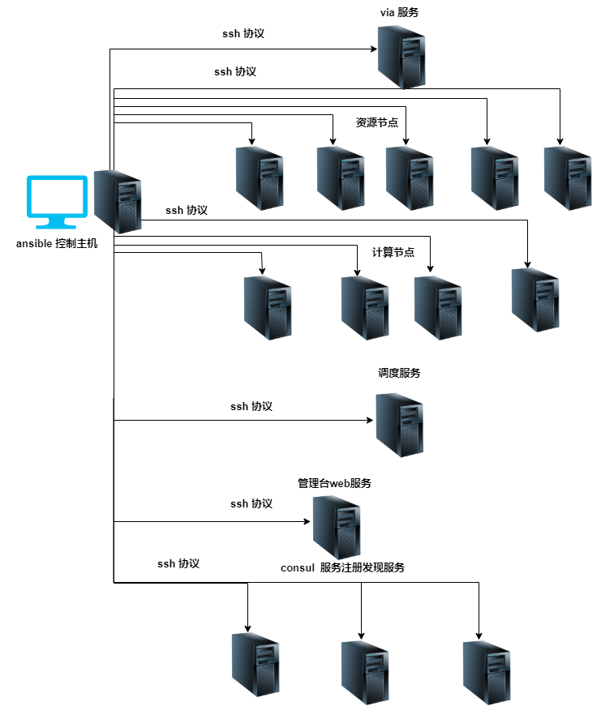

# network 配置事项

1. inventory.ini 配置文件里面配置的 ip 地址为内网 ip， 主控机和目标机在同一个内网中，保证网络互通。

2. 需要配置外网 ip 的是 via 和 carrier， via_external_ip 配置 via 外网 ip， carrier_external_ip 配置 carrier 外网 ip。

3. 服务端口信息
  
| 所属服务 | 变量名称  | 端口含义 | 对那些服务暴露 |
|  ----  | ----  |  ----  | ----  |
|   ice | ice_glacier2_port  |  ice glacier2 port 服务端口号  | 需要对全网开放 |
|   ice | ice_grid_port  |  ice grid port 服务端口号  | 需要对全网开放 |
|   data | data_port  |  data grpc 服务端口号  | 对组织内部的所有服务开发，不对外开放  |
|  compute  | compute_port  |  compute grpc 服务端口号  | 对组织内部的所有服务开发，不对外开放  |
|  admin  | admin_web_port  |  admin web 服务端口号  | 对 consul 开放即可  |
| admin | mysql_listen_port | admin mysql服务端口号 | 对admin开放即可 |
| admin | nginx_listen_port | admin nginx服务端口号(TCP) | 对admin开放即可 |
| admin | nginx_listen_port_ssl | admin nginx服务端口号(SSL) | 对admin开放即可 |
|  carrier  | carrier_pprof_port  |  开发 go 调试接口  | 只能本机访问即可  |
|  carrier  | carrier_rpc_port  | carrier rpc 服务端口号   |  对  moirea 和 via， consul 开放即可  |
|  carrier  | carrier_grpc_gateway_port  | carrier rpc api 的 restful server监听port  | 对  moirea 和 via， consul 开放即可  |
|  carrier  | carrier_p2p_udp_port  |  p2p udp 端口号  | 需要对全网开放  |
|  carrier  | carrier_p2p_tcp_port  |  p2p  端口号  | 需要对全网开放  |
|  consul  | consul_server_port  | 服务器RPC 端口   |  对组织内部开放 |
|  consul  | consul_serf_lan_port  | Serf LAN gossip 通信应该绑定的端口 | 对 consul 服务开放  |
|  consul  | consul_serf_wan_port  |  Serf WAN gossip 通信应该绑定的端口  | 对 consul 服务开放  |
|  consul  | consul_http_port  | HTTP API 端口  | 对组织内部开放  |
|  consul  | consul_dns_port  | DNS 服务器端口  | 对组织内部开放  |

**【注意事项】:** 

1、最后需要对浏览器开通admin的nginx服务端监听端口`$nginx_listen_port`，默认为80；